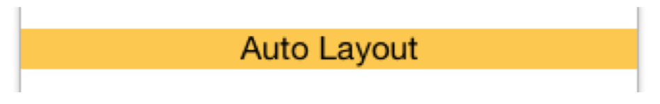
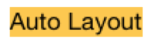

#  Auto Layout, Adaptive Layout stb.

### Milyen külső/belső vátpzásokra kell reagálni az appoknak?
Külső: pl. eszköz elforgatása, hívás, háttérbe helyezés

Belső: Betűméret megváltozása, nyelv megváltozása

### Mi a Safe Area Layout Guide, mit vált le?
A Safe Area a UIView-n belüli használható régiót határolja, a Top/Bottom/Left/Rigth Layout Guide-ot váltja (iPhone X és Apple Watch miatt)

### Egy intrinsic content size-zal rendelkező nézetnél mit takar a Content Compression Resistance és a Content Hugging Priority? (1-1 mondat + egyszerű ábra)
Content Compression Resistance Priority: azon két kényszer prioritása, melyek rögzítik, hogy a nézet nem lehet kisebb mint az intrinsic content size


Content Hugging Priority: azon két kényszer prioritása, melyek azt rögzítik, hogy a nézet nem lehet nagyobb mint az intrinsic content size


### Milyen méretosztályba sorolható az iPhone X landscape tájolásban?
_R_egular Width, _C_ompact Height

### Mi az a Trait Collection?
A készülék méret/tájolásspecifikus tulajdonságait tartalmazza

### Milyen elemei vannak?
* verticalSizeClass / horizontalSizeClass
* User Interface Idiom (iPhone / iPad)
* Display Scale (pixel/point)
* egyéb (pl force touch capability)

### Mi az az Auto Layout?
Az Auto Layout egy deklaratív módja a nézetek méretének és pozíciójának meghatározásának

### Mi az a kényszer, milyen elemei és tulajdonságai vannak?
Egy kényszer két UI elem egymáshoz való elhelyezkedését adja meg  (pl `view.leading = 1.0xotherView.trailing + 10`)

### Milyen lehetőség van kódból létrehozni kényszert?
* `NSLayoutAnchor`: legjobb módszer, rendelkezik type checking-gel
* `NSLayoutConstraint`: csak runtime alatt derülnek ki a hibák
* Visual Format Language: pl `[view]-50.0-[otherView]`; sok a hibalehetőség

### Mi az Adaptive Layout? Milyen problémát old meg?
Az Adaptive Layout-tal különböző orientációjú és méretosztályú lévő eszközökre tudunk UI-t fejleszteni

### Mi alapján teszünk különbséget az eszközök között?
Size class & orientáció alapján

### Hozz létre egy Alert Controllert kódból tetszőleges szöveggel, egy beviteli mezővel és egy gombbal. Írd ki a beviteli mező (Text Field) tartalmát a gomb megnyomásakor a konzolra!
```swift
let alertController = UIAlertController(title: ”Title", message: ”Message", preferredStyle: .alert)
alertController.addTextField { textField in
    textField.placeholder = "Input"
}
let okAction = UIAlertAction(title: "OK", style: .default, handler: {
    print(alertController.textField?.last.text)
})
alertController.addAction(okAction)
present(alertController, animated: true, completion: nil)

```

