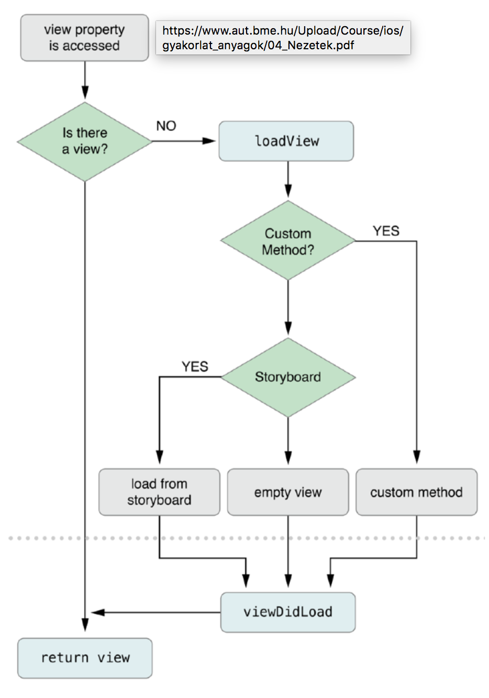

#  Nézetek

### Mi a különbség a `frame` és a `bounds` property között?
`frame`:  szülő nézet koordináta-rendszere

`bounds`: a gyerek nézet koordinkoordináta-rendszere (`self`)
### Mit csinál a `UIView` `clipsToBounds` property-je?
Ha `view.clipsToBounds = true`, akkor a view szülő nézetből kilógó része nem rajzolódik ki

### Milyen `contentMode`-okat ismersz? Mit csinálnak?
`UIViewContentModeLeft`: nem torzítja a képet, csak átméretezi és balra zárja

`UIViewContentModeRight`: nem torzítja a képet, csak átméretezi és jobbra zárja

`UIViewContentModeScaleToFill`: úgy torzítja a képet, hogy pontosan kitöltse a `bounds`-ot

### Milyen `UIControlState`-eket ismersz? Mit csinálnak?
```swift
UIControlState.normal //alapértelmezett
UIControlState.selected //pl. firstResponder-nél
UIControlState.highlighted //be lehet állítani
```
### Sorolj fel 3 gesztusfelismerő osztályt
```swift
UITapGestureRecognizer //kattintás
UISwipeGestureRecognizer //swipe
UIPinchGestureRecognizer //pinch
```
### Hogy történik egy `ViewController` `View`-jának betöltése (kód vagy IB), és az egyes állapotokról milyen értesítéseket kap a `ViewController`!


Értesítések:
```swift
func viewWillAppear(_ animated: Bool)
func viewDidAppear(_ animated: Bool)
func viewWillDisappear(_ animated: Bool)
func viewDidDisappear(_ animated: Bool)
```
### Milyen lehetőségeink vannak iOS-en képek tárolására és megjelenítésére?
Lehet a képet csak simán a project file-ok közé tenni vagy a fáljrendszerről elérni

Lehet a képet az xcassets.plist-be is betenni

### Hogyan dönti el a rendszer, hogy melyik ugyanannak a képnek melyik felbontású változatát töltse be az éppen futó készüléken?
Megnézi hogy hány pont egy pixel, és az annak megfelelőt tölti be (pl image.png, image@2x.png, image@3x.png)

### Írj egy egyszerű UIView leszármazottat, ami kirajzol egy geometriai formát (kör, ellipszis, háromszög, valamilyen ív, stb.). Használj grafikus kontextust vagy UIBezierPath-t!
```swift
class CircleView : UIView {
    var radius: CGFloat
    
    init(radius length: CGFloat) {
        radius = length
    }
    
    override func draw(_ rect: CGRect) {
        if let context = UIGraphicsGetCurrentContext() {
            let rectForCircle = CGRect(x: 10.0, y:10.0, width: radius*2, height: radius*2)
            context.addEllipse(rectrectForCircle)
            context.setStrokeColor(UIColor.blue)
            context.drawPath()
        }
    }
}
```

